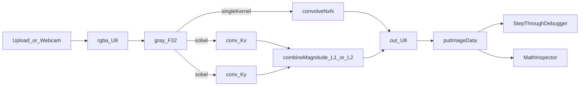

# Boss Level: SobelMagnitude_Debugger_NxN_Borders_URLPerf

## Scope
Implement 5 advanced educational/performance features on top of the current app (which already has webcam mode, a 3×3 kernel, Math Inspector, and `_Into` buffer reuse):
1) Sobel X+Y magnitude (toggle L1/L2)
2) Step-through sliding-window debugger
3) Dynamic odd-sized N×N kernel engine (3/5/7)
4) Border policy toggle (clamp/zero/wrap)
5) Shareable presets in URL + FPS + allocations/frame overlay

## Current baseline (what exists)
- Single-kernel 3×3 convolution: `[web/src/lib/cv/convolution3x3.ts](web/src/lib/cv/convolution3x3.ts)`
- Buffer reuse for webcam loop in `[web/src/app/page.tsx](web/src/app/page.tsx)`
- Math Inspector overlay + utility: `[web/src/components/MathInspectorOverlay.tsx](web/src/components/MathInspectorOverlay.tsx)`, `[web/src/lib/cv/inspector3x3.ts](web/src/lib/cv/inspector3x3.ts)`
- `_Into` variants exist for grayscale/convolution/gray->rgba

## Architecture changes (high level)
### Core engine becomes NxN + policy-driven
Introduce a general engine that all modes call:
- Input: grayscale `Float32Array` (pre-convolution)
- Kernel: `Float32Array` (length `kSize*kSize`) or `number[]`
- Policy: `'clamp' | 'zero' | 'wrap'`
- Output: `Uint8ClampedArray`
- Into variant to reuse caller buffers

### Pipeline supports “single kernel” and “sobel magnitude”
Add a Sobel pipeline that reuses shared grayscale buffer and runs:
- `convolveNxNInto(gray, sobelX, ...) → gxF32` (or `Int16Array`)
- `convolveNxNInto(gray, sobelY, ...) → gyF32`
- `combineMagnitudeInto(gx, gy, mode=L1|L2) → outU8`

### UI splits into 3 modes
- **Realtime**: webcam/upload drives processing
- **Paused**: freeze last input frame and allow step-through
- **Debugger**: move window (x,y) and render overlay + equation

## Feature 1 — Sobel X+Y Edge Magnitude
### Math
- Compute gradients:
  - \(G_x = K_x * I\)
  - \(G_y = K_y * I\)
- Combine (toggle):
  - **L1 (fast)**: \(M = |G_x| + |G_y|\)
  - **L2 (canonical)**: \(M = \sqrt{G_x^2 + G_y^2}\)

### Implementation
- Add module: `[web/src/lib/cv/sobelMagnitude.ts](web/src/lib/cv/sobelMagnitude.ts)`
  - `sobelMagnitude3x3Into(gray, w, h, policy, mode, outU8, scratchGx, scratchGy)`
  - Keep **scratch buffers** in refs, allocated once per resolution.

## Feature 2 — Step-through Sliding Window Debugger
### UX
- “Pause” button stops RAF loop and freezes current frame.
- Slider/stepper controls:
  - X: 0..(w-1)
  - Y: 0..(h-1)
  - Step buttons: left/right/up/down
- Overlay:
  - Highlight N×N neighborhood on the **input canvas**
  - Show equation similar to existing inspector, but driven by the selected (x,y), not pointer.

### Implementation
- Add component: `[web/src/components/SlidingWindowDebugger.tsx](web/src/components/SlidingWindowDebugger.tsx)`
  - Controls + renders current (x,y)
  - Calls a shared “inspect at pixel” utility (generalized to NxN)
- Add draw helper: `[web/src/lib/ui/drawKernelOverlay.ts](web/src/lib/ui/drawKernelOverlay.ts)`
  - Draw grid overlay onto an overlay canvas layered on top of the input canvas (no image mutation).

## Feature 3 — Dynamic N×N Kernel Engine (odd sizes up to 7×7)
### API design
- Add module: `[web/src/lib/cv/convolutionNxN.ts](web/src/lib/cv/convolutionNxN.ts)`
  - `type BorderPolicy = 'clamp' | 'zero' | 'wrap'`
  - `convolveGrayNxNInto(gray, w, h, kernelF32, kSize, policy, scale, bias, outU8)`

### Core loop (time complexity)
- \(O(W \cdot H \cdot K^2)\) where \(K\) is kernel size.
- Compute radius: `r = (kSize - 1) / 2`.
- Flatten kernel row-major for cache friendliness.

## Feature 4 — Border Policy Toggle
### Policies
- **clamp**: sample coordinates clamped to [0..w-1]/[0..h-1]
- **zero**: out-of-bounds samples treated as 0
- **wrap**: modulo wrap-around (toroidal)

### UI
- Toggle/select: Clamp / Zero / Wrap
- Short math explanation snippet beside selector.

## Feature 5 — Shareable Presets & Performance Monitor
### URL state encoding
- Add hook: `[web/src/hooks/useQueryState.ts](web/src/hooks/useQueryState.ts)`
  - Encodes/decodes:
    - `k` (kernel values comma-separated, length K^2)
    - `kSize` (3|5|7)
    - `scale`, `bias`
    - `policy` (clamp|zero|wrap)
    - `mode` (upload|webcam)
    - `edge` (off|sobel) and `mag` (l1|l2)
  - Uses Next App Router `useSearchParams` + `router.replace` to avoid full navigation.

### FPS + allocations/frame overlay
- Add component: `[web/src/components/PerfOverlay.tsx](web/src/components/PerfOverlay.tsx)`
  - FPS: moving average from rAF timestamps.
  - “Allocations/frame”:
    - **Explain clearly in UI**: browser APIs like `getImageData()` allocate internally; we instead prove **0 allocations in our app loop** by:
      - Reusing typed arrays via `_Into` functions
      - Tracking that our buffers are stable references across frames
      - Optionally exposing a counter that increments if a buffer resize/allocation occurs
    - (Optional, Chrome-only) show `performance.memory.usedJSHeapSize` deltas as a heuristic.

## Implementation sequence (minimal risk)
1) Add `convolutionNxN` + `BorderPolicy` utilities (keep existing 3×3 wrapper calling NxN).
2) Add Sobel magnitude module with reusable scratch buffers.
3) Add UI state: kernel size selector (3/5/7), policy selector, edge-mode toggle (off/sobel) + magnitude toggle.
4) Add step-through debugger overlay and pixel inspector generalized to NxN.
5) Add query-string state hook + perf overlay; wire everything into `[web/src/app/page.tsx](web/src/app/page.tsx)`.

## Mermaid: updated processing paths

