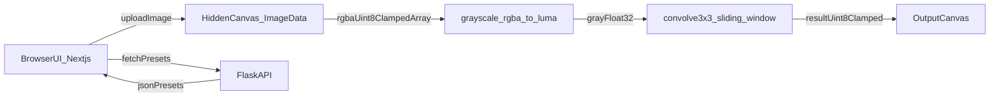

# X-Ray Vision: Matrix Convolution Engine (Next.js + Flask)

## Target architecture
- **Monorepo layout**
  - `[web/](web/)`: Next.js (App Router) + Tailwind + `<canvas>` UI + pure-math image ops
  - `[server/](server/)`: Flask API (`server/main.py`) for kernel presets, saving configs, optional image persistence later
  - `[docker-compose.yml](docker-compose.yml)`: run both services locally



## Frontend (Next.js) core modules
### 1) UI & canvas pipeline
- **Create page**: `[web/app/page.tsx](web/app/page.tsx)`
  - `<input type="file" accept="image/*" />`
  - `img` element for decode (or `createImageBitmap`) then draw to **hidden** canvas
  - read `ctx.getImageData(0, 0, w, h).data` (RGBA `Uint8ClampedArray`)
  - show two canvases: **original** and **filtered**

### 2) Grayscale conversion (pure math, optimized)
- **Module**: `[web/src/lib/cv/grayscale.ts](web/src/lib/cv/grayscale.ts)`
- **Function shape** (uses standard arrays/typed arrays; no CV libs):

```ts
export function rgbaToGrayscaleLuma(
  rgba: Uint8ClampedArray,
  width: number,
  height: number
): Float32Array {
  // Luma approximation (Rec.601): 0.299R + 0.587G + 0.114B
  // Using Float32Array for fast numeric ops and to avoid repeated clamping.
  const gray = new Float32Array(width * height);
  for (let i = 0, p = 0; p < gray.length; p++, i += 4) {
    const r = rgba[i];
    const g = rgba[i + 1];
    const b = rgba[i + 2];
    gray[p] = 0.299 * r + 0.587 * g + 0.114 * b;
  }
  return gray;
}
```

### 3) Convolution engine (O(N×M) sliding window, dynamic 3×3)
- **Module**: `[web/src/lib/cv/convolution3x3.ts](web/src/lib/cv/convolution3x3.ts)`
- **Kernel**: `number[3][3]` or flattened `Float32Array(9)` (faster); UI binds to 3×3 grid.
- **Border policy** (choose a deterministic default): **clamp-to-edge** (replicate border) so output keeps same size.

```ts
export type Kernel3x3 = [
  [number, number, number],
  [number, number, number],
  [number, number, number]
];

function clamp(v: number, lo: number, hi: number) {
  return v < lo ? lo : v > hi ? hi : v;
}

export function convolve3x3Gray(
  gray: Float32Array,
  width: number,
  height: number,
  k: Kernel3x3,
  opts?: { bias?: number; scale?: number }
): Uint8ClampedArray {
  const out = new Uint8ClampedArray(width * height);
  const bias = opts?.bias ?? 0;
  const scale = opts?.scale ?? 1;

  // Sliding window: for each output pixel, dot(kernel, 3x3 neighborhood)
  for (let y = 0; y < height; y++) {
    const y0 = clamp(y - 1, 0, height - 1);
    const y1 = y;
    const y2 = clamp(y + 1, 0, height - 1);

    for (let x = 0; x < width; x++) {
      const x0 = clamp(x - 1, 0, width - 1);
      const x1 = x;
      const x2 = clamp(x + 1, 0, width - 1);

      const p00 = gray[y0 * width + x0];
      const p01 = gray[y0 * width + x1];
      const p02 = gray[y0 * width + x2];
      const p10 = gray[y1 * width + x0];
      const p11 = gray[y1 * width + x1];
      const p12 = gray[y1 * width + x2];
      const p20 = gray[y2 * width + x0];
      const p21 = gray[y2 * width + x1];
      const p22 = gray[y2 * width + x2];

      const sum =
        k[0][0] * p00 + k[0][1] * p01 + k[0][2] * p02 +
        k[1][0] * p10 + k[1][1] * p11 + k[1][2] * p12 +
        k[2][0] * p20 + k[2][1] * p21 + k[2][2] * p22;

      // scale/bias for teaching: show raw math then map to display range
      const v = sum * scale + bias;
      out[y * width + x] = v < 0 ? 0 : v > 255 ? 255 : v;
    }
  }

  return out;
}
```

### 4) Real-time 3×3 UI grid bound to state
- **Component**: `[web/src/components/KernelGrid3x3.tsx](web/src/components/KernelGrid3x3.tsx)`
  - Render 9 `<input type="number" step="0.1" />`
  - State: `const [kernel, setKernel] = useState<Kernel3x3>(...)`
  - On change: update kernel and recompute output (debounce optional)
- **Recompute strategy**
  - Use `useMemo` for derived arrays + `useEffect` to redraw output canvas.
  - Keep one decode step; re-run **only** grayscale+convolution when kernel changes.

### 5) Render output back to RGBA for canvas
- **Module**: `[web/src/lib/cv/grayToRgba.ts](web/src/lib/cv/grayToRgba.ts)`
  - Convert `outGrayUint8` into RGBA `Uint8ClampedArray` with alpha 255.

## Backend (Flask)
### Minimal server structure
- **Entry**: `[server/main.py](server/main.py)`
  - `GET /health`
  - `GET /kernels` returns JSON presets (Sobel X/Y, Laplacian, Sharpen, Box blur)
  - (Optional later) `POST /kernels` to save custom kernels

Example shape:

```py
from flask import Flask, jsonify
from flask_cors import CORS

app = Flask(__name__)
CORS(app)

KERNELS = {
  "sobel_x": [[-1,0,1],[-2,0,2],[-1,0,1]],
  "sobel_y": [[-1,-2,-1],[0,0,0],[1,2,1]],
  "laplacian": [[0,1,0],[1,-4,1],[0,1,0]],
  "sharpen": [[0,-1,0],[-1,5,-1],[0,-1,0]],
  "box_blur": [[1,1,1],[1,1,1],[1,1,1]],
}

@app.get("/health")
def health():
  return {"ok": True}

@app.get("/kernels")
def kernels():
  return jsonify(KERNELS)

if __name__ == "__main__":
  app.run(host="0.0.0.0", port=5000, debug=True)
```

## Docker
- **`web/Dockerfile`**: Node image, install deps, build, run `next start`
- **`server/Dockerfile`**: Python slim, install `flask` + `flask-cors`, run `python main.py`
- **`docker-compose.yml`** (root)
  - `web` on `3000:3000`
  - `server` on `5000:5000`
  - set `NEXT_PUBLIC_API_BASE=http://localhost:5000`

## Validation checklist (what I’ll verify after implementation)
- Upload PNG/JPG → hidden canvas read works
- Kernel edits cause instant redraw (no page refresh)
- Convolution matches known behavior on a test image (Sobel/Laplacian look correct)
- Docker Compose brings up both services and frontend can fetch `/kernels`

