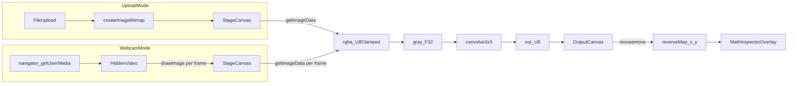

# Math Inspector + Live Webcam Convolution

## Goals
- Add **Math Inspector**: hover the output canvas and show a floating panel with:
  - pixel coordinate 
  - the **3×3 pre-convolution grayscale neighborhood** (inputs)
  - the **kernel coefficients**
  - the **raw dot-product equation** and numeric result (before and after scale/bias/clamp)
  - optionally show the **post-convolution output pixel value**
- Add **Live Webcam Convolution** with a **mode toggle** (Upload vs Webcam) using:
  - hidden `<video>` + staging `<canvas>` to extract `ImageData`
  - `requestAnimationFrame` loop
  - **buffer reuse** to avoid per-frame allocations

## Key files to add/change
- Update `[web/src/app/page.tsx](web/src/app/page.tsx)`
  - Add mode toggle (Upload/Webcam)
  - Integrate inspector event handlers on output canvas
  - Use a realtime pipeline for webcam frames
- Add `[web/src/lib/cv/inspector3x3.ts](web/src/lib/cv/inspector3x3.ts)`
  - Reverse mapping (canvas x,y → image x,y → index)
  - Extract 3×3 neighborhood with clamp-to-edge
  - Compute dot product using current `Kernel3x3`, plus scale/bias
  - Build an equation string efficiently
- Add `[web/src/components/MathInspectorOverlay.tsx](web/src/components/MathInspectorOverlay.tsx)`
  - Floating overlay UI (Tailwind)
  - Shows neighborhood table + equation + final value
- Add `[web/src/hooks/useWebcamStream.ts](web/src/hooks/useWebcamStream.ts)`
  - `getUserMedia` lifecycle + cleanup
  - Attach stream to hidden `<video>`

## Data flow

## Math Inspector implementation details
### 1) Reverse mapping (mouse → pixel index)
- Use `getBoundingClientRect()` on the output canvas.
- Convert CSS pixel coords → canvas pixel coords:
  - `cx = (clientX - rect.left) * (canvas.width / rect.width)`
  - `cy = (clientY - rect.top) * (canvas.height / rect.height)`
- Convert to integer pixel coordinates:
  - `x = clamp(Math.floor(cx), 0, width-1)`
  - `y = clamp(Math.floor(cy), 0, height-1)`

### 2) Neighborhood extraction + edge cases
- Use the same border policy as convolution: **clamp-to-edge**.
- For pixels near the border, neighbors outside the image map to the nearest valid edge pixel.

### 3) Live dot product + equation string
- Compute the 9 grayscale inputs `p00..p22` from `Float32Array gray`.
- Compute raw sum: `sum = Σ(kij * pij)`.
- Apply `v = sum * scale + bias` and clamp to `0..255`.
- Display equation as:
  - `p00*(k00) + p01*(k01) + ... + p22*(k22) = sum`
  - plus a second line for `sum*scale + bias = v` and `clamp(v)=out`.

Performance notes:
- Build the equation with a **single string builder** (array of parts + join) to avoid many concatenations.
- Update inspector state on `requestAnimationFrame` (throttle mousemove) to avoid React re-render storms.

## Webcam stream + realtime loop
### 1) `useWebcamStream` hook
- On enable:
  - `navigator.mediaDevices.getUserMedia({ video: { facingMode: 'environment' } })`
  - assign to `videoRef.current.srcObject`
  - `await video.play()` when metadata is ready
- On cleanup:
  - stop tracks: `stream.getTracks().forEach(t => t.stop())`
  - set `video.srcObject = null`

### 2) requestAnimationFrame loop (buffer reuse)
- Keep a staging canvas context with `willReadFrequently: true`.
- Allocate buffers **once** when dimensions are known:
  - `grayF32 = new Float32Array(w*h)`
  - `outU8 = new Uint8ClampedArray(w*h)`
  - `outRgba = new Uint8ClampedArray(w*h*4)`
  - `imageData = ctx.createImageData(w,h)` (for output)
- For each frame:
  - `ctx.drawImage(video, 0,0,w,h)`
  - `rgba = ctx.getImageData(0,0,w,h).data` (browser allocates; unavoidable)
  - fill `grayF32` in-place (modify grayscale util or add an `*_Into` variant)
  - run convolution into `outU8` (add an `*_Into` variant to write to provided output)
  - expand `outU8` into `outRgba` in-place
  - `imageData.data.set(outRgba)` then `outputCtx.putImageData(imageData,0,0)`

Memory leak avoidance:
- Store RAF id in `useRef` and `cancelAnimationFrame` on unmount or mode switch.
- Stop camera tracks on mode switch away from webcam.
- Don’t create new arrays inside the frame loop.

## Concrete todos
- Add `inspector3x3` utility that returns `x,y`, neighborhood values, kernel values, `sum`, `scaled`, `clamped`, and `equationLines`.
- Add `MathInspectorOverlay` component positioned near cursor; hide when mouse leaves canvas.
- Add `useWebcamStream` hook + hidden `<video>` element.
- Refactor current upload pipeline so both upload and webcam feed the same “process frame” function.
- Add `Into` variants for grayscale/convolution to support buffer reuse in webcam mode.

## Acceptance criteria
- Hovering output canvas shows correct 3×3 neighborhood and equation matching current kernel, scale, bias.
- Inspector behaves correctly at borders (clamp-to-edge).
- Webcam mode runs smoothly with stable memory (no per-frame typed-array allocations from app code).
- Switching modes stops RAF loop and camera tracks cleanly.
