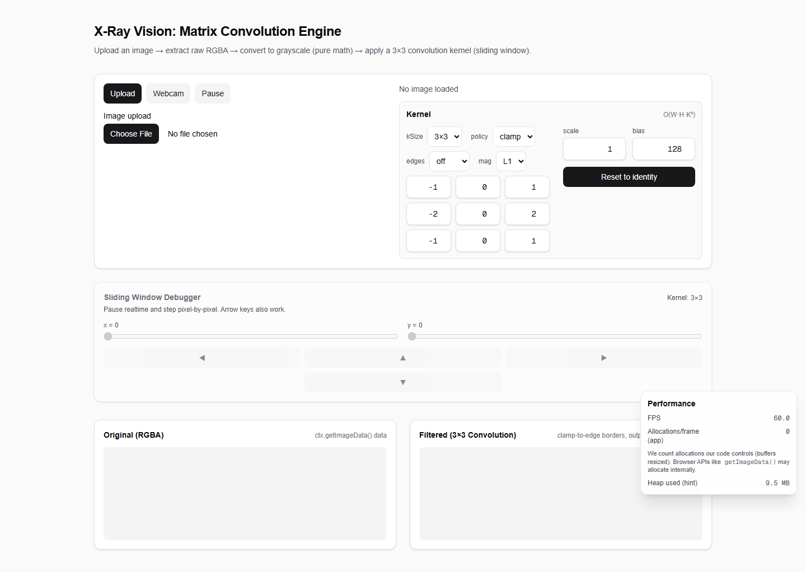
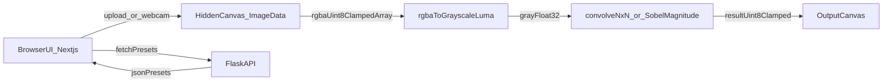

# X-Ray Vision: Matrix Convolution Engine (Next.js + Flask)

Interactive educational web application that demonstrates the **raw mathematics** behind image filtering and edge detection using a **from-scratch convolution engine** (dynamic **3×3 / 5×5 / 7×7**).

Crucial constraint: **No ready-made computer vision libraries** (e.g. OpenCV). The client-side engine operates directly on `ImageData` RGBA arrays and uses pure procedural math with typed arrays.

## What it can do (Boss Level)
- **Sources**: Upload image or **Live Webcam** (frame-by-frame convolution via `requestAnimationFrame`)
- **Dynamic kernel**: 3×3 / 5×5 / 7×7 kernel grid + `scale` + `bias`
- **Border policy toggle**: `clamp` / `zero` / `wrap`
- **Sobel edge magnitude**: compute **Gx + Gy** with magnitude toggle (**L1** or **L2**)
- **Math Inspector**: hover output canvas to see the exact neighborhood + dot-product equation
- **Sliding Window Debugger**: pause realtime feed and step pixel-by-pixel (x,y), with NxN equation
- **Shareable URL state**: kernel/policy/scale/bias/mode/edge settings encoded into query params
- **Performance overlay**: FPS + “Allocations/frame (app-controlled buffers)”

## Screenshot



## Architecture



- **Frontend**: Next.js (App Router) + Tailwind CSS + HTML5 `<canvas>` + TypeScript
- **Algorithm execution**: Client-side TypeScript using standard/typed arrays
- **Backend**: Flask (Python) for kernel presets and future storage/config endpoints
- **Deployment**: Docker + Docker Compose

## Repo layout

```
.
├─ web/                      # Next.js app (UI + canvas + math engine)
│  ├─ src/app/page.tsx        # Upload/Webcam + NxN kernel + debugger + URL state + perf overlay
│  ├─ src/components/
│  │  ├─ KernelGridNxN.tsx           # 3/5/7 kernel grid input
│  │  ├─ MathInspectorOverlay.tsx    # hover math panel
│  │  ├─ SlidingWindowDebugger.tsx   # pause + stepper UI
│  │  └─ PerfOverlay.tsx             # FPS + allocations overlay
│  └─ src/lib/cv/
│     ├─ grayscale.ts         # RGBA -> grayscale luma (Float32)
│     ├─ convolutionNxN.ts    # Sliding-window NxN convolution + border policy (O(W*H*K^2))
│     ├─ convolution3x3.ts    # 3×3 wrapper delegating to NxN
│     ├─ sobelMagnitude.ts    # Sobel Gx/Gy + magnitude (L1/L2)
│     └─ grayToRgba.ts        # Grayscale U8 -> RGBA for canvas ImageData
├─ docs/
│  └─ screenshot.png          # README screenshot
├─ server/
│  ├─ main.py                 # Flask API: /health and /kernels
│  └─ requirements.txt        # flask, flask-cors
└─ docker-compose.yml         # Run web + server together
```

## The math pipeline (what happens in the browser)

### 1) UI & Canvas Setup (RGBA extraction)
1. User uploads an image in the UI.
2. The browser decodes it via `createImageBitmap(file)`.
3. It is drawn to a **staging (hidden) canvas**.
4. We extract raw pixels:
   - `ctx.getImageData(0, 0, w, h).data`
   - This returns a `Uint8ClampedArray` laid out as **RGBA** in a 1D array:
     - `rgba[i+0]=R, rgba[i+1]=G, rgba[i+2]=B, rgba[i+3]=A`

Key code lives in `web/src/app/page.tsx` (`fileToRgba()`).

### 2) Grayscale conversion (pure math)
We convert RGB to grayscale luminance (Rec.601 luma):

\[
Y = 0.299R + 0.587G + 0.114B
\]

Implementation: `web/src/lib/cv/grayscale.ts` (`rgbaToGrayscaleLuma`).

- Input: `Uint8ClampedArray` RGBA
- Output: `Float32Array` grayscale (one value per pixel)

### 3) NxN Convolution engine (sliding window, O(W*H*K^2))
For each pixel, we take its **K×K neighborhood** and compute a dot product with a dynamic odd-sized kernel (K = 3/5/7):

\[
out(x,y) = \\sum_{j=-r}^{r} \\sum_{i=-r}^{r} k(i,j)\\cdot gray(x+i, y+j)
\]

- **Border policy**: selectable (`clamp`, `zero`, `wrap`) to demonstrate boundary effects.
- **Educational knobs**:
  - `scale`: normalize kernels (e.g. box blur uses scale \(1/9\))
  - `bias`: shift output (e.g. `128` to visualize signed gradients)
- Final output is clamped to `0..255` for display.

Implementation: `web/src/lib/cv/convolutionNxN.ts` (`convolveGrayNxNInto`) and `web/src/lib/cv/convolution3x3.ts` (compat wrapper).

### 4) Real-time interactivity (NxN kernel grid)
The UI renders an NxN numeric input grid and binds it to React state.
Any coefficient change triggers immediate re-computation and redraw.

- Component: `web/src/components/KernelGridNxN.tsx`
- Wiring: `web/src/app/page.tsx`

### 5) Sobel edge magnitude (Gx + Gy)
Optionally compute Sobel gradients and combine as edge magnitude:
- L1: \(M = |G_x| + |G_y|\)
- L2: \(M = \\sqrt{G_x^2 + G_y^2}\)

Implementation: `web/src/lib/cv/sobelMagnitude.ts`.

### 6) Debug/Inspector features
- **Math Inspector** (hover output): shows neighborhood + dot product equation.
- **Sliding Window Debugger**: pause and step (x,y), plus NxN equation panel.

See `explaination.md` for the full teaching walkthrough.

### 5) Convert filtered grayscale back to RGBA for canvas
Canvas `ImageData` expects RGBA, so we expand 1-channel grayscale to RGBA with alpha=255.

Implementation: `web/src/lib/cv/grayToRgba.ts` (`grayU8ToRgba`).

## Flask backend

Location: `server/main.py`

Endpoints:
- `GET /health` → `{ "ok": true }`
- `GET /kernels` → JSON map of preset kernels:
  - Sobel X/Y, Laplacian, Sharpen, Box blur

Notes:
- CORS is enabled via `flask-cors` for frontend integration.
- The current UI does not yet fetch these presets (the endpoint is ready).

## Run with Docker Compose (recommended)

From repo root:

```bash
docker compose up --build
```

- Web: `http://localhost:3000`
- Server: `http://localhost:5000`

## Run locally (without Docker)

### Frontend

```bash
cd web
npm install
npm run dev
```

Open `http://localhost:3000`.

### Backend

```bash
cd server
python -m venv .venv
.\.venv\Scripts\activate
pip install -r requirements.txt
python main.py
```

Open:
- `http://localhost:5000/health`
- `http://localhost:5000/kernels`

## Implementation notes / constraints
- **No OpenCV / no CV libraries**: all image operations are implemented from scratch on raw arrays.
- **Performance**: inner loops use typed arrays and simple arithmetic; realtime webcam mode uses `_Into` variants and buffer reuse to reduce GC pressure.
